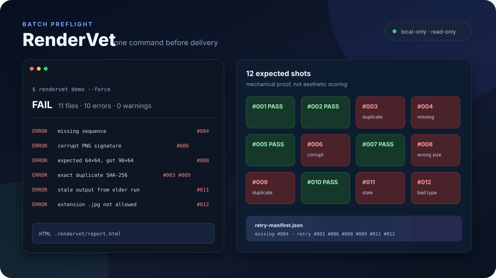

# RenderVet

[](https://github.com/lierwang823/rendervet/actions/workflows/ci.yml)
[](https://www.python.org/)
[](LICENSE)

**Preflight image, audio, and video batches before delivery. Catch missing, corrupt,
duplicate, stale, and off-spec outputs with one local command.**

[中文说明](README.zh-CN.md)



Render pipelines fail quietly. A folder can look complete while one numbered output is
missing, another is truncated, two are byte-identical, and an old file is being mistaken
for a fresh render. RenderVet checks the folder against a small TOML contract and produces:

- a human-friendly offline HTML report;
- a stable JSON report for CI and automation;
- a retry manifest containing the exact failed files and missing sequence numbers.

RenderVet is deterministic, model-agnostic, local-only, and read-only. It does not judge
whether an image looks good, upload media, regenerate files, or execute the retry manifest.

## Try the deliberately broken demo

```bash
git clone https://github.com/lierwang823/rendervet.git
cd rendervet
python3 -m venv .venv
.venv/bin/pip install -e .
.venv/bin/rendervet demo --force --open
```

Windows PowerShell uses `.venv\Scripts\pip` and `.venv\Scripts\rendervet`.

The demo defines twelve expected geometric images with six intentionally different failure
types, then prints a real scan result (abridged here):

```text
RenderVet  RenderVet demo: intentionally broken batch
FAIL  11 files · 10 errors · 0 warnings

✗ shots: 11 files · 10 errors · 0 warnings
  ERROR count_mismatch: expected 12 files; found 11
  ERROR media_probe_failed: invalid PNG signature [shot_006.png]
  ...
  ERROR width_mismatch: expected width 64; got 96 [shot_008.png]
  ERROR stale_file: file predates fresh_after [shot_011.png]
  ERROR extension_not_allowed: extension .jpg is not allowed [shot_012.jpg]
  ERROR sequence_item_missing: expected sequence number 4 is missing
  ERROR exact_duplicate: 2 files have identical content [shot_003.png]
  ERROR exact_duplicate: 2 files have identical content [shot_009.png]
```

## Install from GitHub

Until the first PyPI release, install directly from the public repository:

```bash
pipx install git+https://github.com/lierwang823/rendervet.git
# or
python -m pip install git+https://github.com/lierwang823/rendervet.git
```

Run `rendervet --version` to confirm the installed version.

## Check your own batch

Create a starter contract and output folder:

```bash
rendervet init my-render-job --name "Product launch renders"
```

Edit `my-render-job/rendervet.toml`:

```toml
version = 1

[project]
name = "Product launch renders"
root = "outputs"
report_dir = ".rendervet"

[[batch]]
id = "hero-images"
glob = "hero_*"
kind = "image"
expected_count = 24
sequence_regex = 'hero_(\d+)'
sequence_start = 1
sequence_end = 24
allowed_extensions = [".png"]
min_bytes = 1024
width = 1536
height = 1024
duplicates = "error"
```

Put the outputs in `my-render-job/outputs`, then run:

```bash
rendervet check my-render-job/rendervet.toml --open
```

Reports are written to the configured `report_dir`:

```text
.rendervet/
├── report.html
├── report.json
└── retry-manifest.json
```

## What v0.1 checks

| Check | Example | Stable reason code |
| --- | --- | --- |
| Expected file count | 55 files found, 56 expected | `count_mismatch` |
| Numbered sequence gaps | `beat_08.png` is absent | `sequence_item_missing` |
| Duplicate sequence numbers | two files both parse as item 8 | `sequence_number_duplicate` |
| Exact duplicates | two files have the same SHA-256 | `exact_duplicate` |
| Empty or undersized files | output is 0 bytes | `file_too_small` |
| Corrupt image structure | truncated PNG or bad CRC | `media_probe_failed` |
| Allowed extensions | JPEG appears in a PNG batch | `extension_not_allowed` |
| Dimensions | 1024×1024 instead of 1536×1024 | `width_mismatch` |
| Freshness | a previous run's file is reused | `stale_file` |
| Audio/video streams | missing audio or unreadable container | `audio_stream_missing` |
| Duration | clip is outside the allowed range | `duration_too_short` |
| Unsafe input | matching file is a symlink | `symlink_not_allowed` |

Images are inspected natively for PNG, JPEG, GIF, WebP, and BMP. Audio and video checks
use `ffprobe` when those media types appear in a contract. Install FFmpeg with Homebrew,
APT, Winget, or the package manager for your platform.

The complete schema is documented in [docs/contract.md](docs/contract.md).

## CI usage

RenderVet uses predictable exit codes:

| Code | Meaning |
| --- | --- |
| `0` | Scan completed with no errors |
| `1` | Scan completed and the batch violated the contract |
| `2` | The contract, CLI arguments, or scan environment is invalid |

```yaml
- name: Preflight render artifacts
  run: rendervet check render-job/rendervet.toml --no-color
- name: Upload RenderVet report
  if: always()
  uses: actions/upload-artifact@v4
  with:
    name: rendervet-report
    path: render-job/.rendervet/
```

Use `--json` for machine-readable stdout and `--strict-warnings` when warnings should fail CI.

## Safety and privacy

- Scans are local. RenderVet has no network client, account, API key, or telemetry.
- Source media is opened read-only and is never renamed, deleted, moved, or regenerated.
- Symlinks are not inspected.
- Contract globs cannot be absolute or escape `project.root` with `..`.
- Reports use relative paths and escape untrusted filenames.
- Report files are written atomically; symlink report targets are refused.
- Retry manifests are data, not executable instructions.

## Honest limitations

RenderVet v0.1 detects byte-identical duplicates, not perceptually similar media. Image probes
validate supported container structure and dimensions, but do not judge composition or prompt
adherence. Audio/video checks need `ffprobe`; full decode, black-frame detection, silence
detection, and perceptual duplicate detection are planned rather than claimed.

## Roadmap

- full audio/video decode verification via optional FFmpeg;
- black-frame and whole-file silence detection;
- perceptual duplicate groups with disclosed thresholds;
- expected filename templates in addition to regular expressions;
- tested recipes for ComfyUI, render farms, and CI artifact gates;
- portable single-file or native releases.

See [CONTRIBUTING.md](CONTRIBUTING.md) before opening a pull request. Please report security
issues through [SECURITY.md](SECURITY.md).

## License

[MIT](LICENSE)
